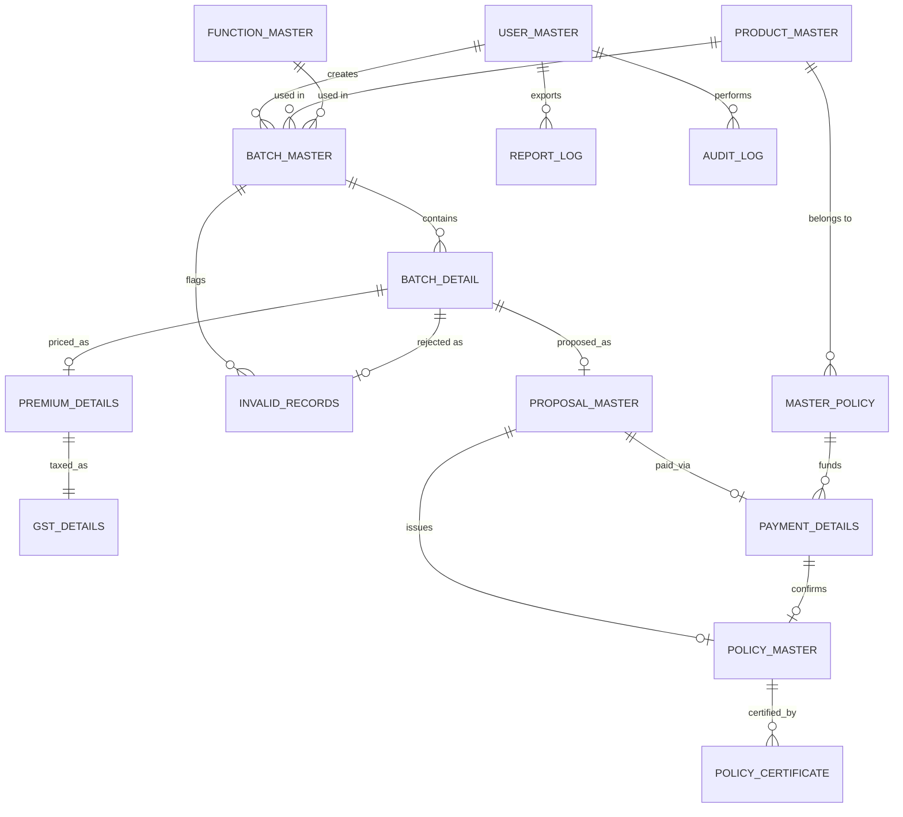

# MotorPortalDB

PostgreSQL database for **Motor Portal**, a bulk motor-insurance policy
issuance system. This repo owns the schema, constraints, PL/pgSQL
functions/procedures, reporting view, and seed data — the source of truth
for structure and for the business rules that must never be bypassed
(batch size cap, lifecycle ordering, CD-balance arithmetic).

Database: `motorportal` · Schema: `SGInsurance` · Engine: PostgreSQL 15+
(verified against 16).

Part of the 4-repo Motor Portal system:
[MotorPortalAPI](https://github.com/imsunilg/MotorPortalAPI) ·
[MotorPortalWEB](https://github.com/imsunilg/MotorPortalWEB) ·
**MotorPortalDB** ·
[MotorPortalDOC](https://github.com/imsunilg/MotorPortalDOC) (architecture,
ER diagram, API reference, setup guide, changelog for the whole system).

## Tech stack

- PostgreSQL 15+ (developed/verified against 16)
- Plain PL/pgSQL (no vendor extensions beyond `pgcrypto`, used for bcrypt
  password hashing in seed data)
- Two equivalent ways to apply the schema: bash (`migrate.sh` / `rollback.sql`)
  or a .NET console app (`MotorPortalDB.Executor`) — pick whichever fits your
  environment, both run the exact same SQL files.

## Folder structure

```
scripts/
  00_create_database.sql   # creates motorportal
  01_create_schema.sql     # creates schema SGInsurance
  02_tables/                # one file per table (15 files)
  03_constraints_indexes.sql
  04_functions/              # functions & procedures (one file each)
  05_views/
  06_seed_data.sql
migrate.sh
rollback.sql
MotorPortalDB.Executor/    # .NET 8 console app, same effect as migrate.sh
MotorPortalDB.sln
```

## How to run locally

### Option A — bash

```bash
export PGHOST=localhost PGPORT=5432 PGUSER=postgres PGPASSWORD=yourpassword
# On Windows, point PSQL at the installed binary if it's not on PATH:
export PSQL="/c/Program Files/PostgreSQL/16/bin/psql"
bash migrate.sh
```

This creates the database, schema, all 15 tables with constraints/indexes,
the PL/pgSQL functions/procedures, the reporting view, and seed data — in
that order, idempotently (safe to re-run).

To start over: `psql -d motorportal -f rollback.sql` (drops the whole
schema), then re-run `migrate.sh`.

### Option B — .NET executor

For environments without bash/psql on `PATH` (or to run the setup as a
.NET tool/CI step), `MotorPortalDB.Executor` does the same job:

```bash
cd MotorPortalDB.Executor
dotnet run
```

It reads connection settings from `appsettings.json` (defaults:
`localhost:5432`, user `postgres`, password `postgres`, target database
`motorportal`), overridable via the same environment variables as
`migrate.sh` (`PGHOST`, `PGPORT`, `PGUSER`, `PGPASSWORD`, `PGDATABASE`).
Behavior:

1. Creates the target database if it doesn't exist yet.
2. Checks whether schema `SGInsurance` already has any tables. If it does,
   it prints a message and exits without touching anything — safe to run
   repeatedly (e.g. as a startup step) without re-seeding or duplicating
   data.
3. If the schema is empty, it runs every script under `scripts/` in the
   same order as `migrate.sh` (schema → tables → indexes → functions →
   views → seed data) against the target database.

There's no equivalent of `rollback.sql` in the executor — use the SQL
script directly (`psql -d motorportal -f rollback.sql`) if you need to
reset before re-running the executor.

**Seeded login (either option):** username `admin`, password `admin123`
(bcrypt-hashed via `pgcrypto`).

## Entities (15)

`user_master`, `product_master`, `function_master`, `master_policy`,
`batch_master`, `batch_detail`, `invalid_records`, `premium_details`,
`gst_details`, `proposal_master`, `payment_details`, `policy_master`,
`policy_certificate`, `report_log`, `audit_log`.

Note: the `.sql` files are written in UPPER_SNAKE_CASE, but PostgreSQL
folds unquoted identifiers to lowercase, so the real, physical names above
are lowercase snake_case — this is also how MotorPortalAPI's EF Core
mapping addresses them. See MotorPortalDOC's
[`docs/er-diagram.md`](https://github.com/imsunilg/MotorPortalDOC/blob/main/docs/er-diagram.md)
for the full diagram and cardinality notes.

## ER diagram



(Entity names shown here in the conceptual UPPER_SNAKE_CASE used in
diagrams/prose; physical table names in the running database are
lowercase — see above.)

## Functions & procedures

| Name | Type | Purpose |
|---|---|---|
| `fn_calculate_net_premium(base, addon, discount)` | function | `NET = base + addon - discount` |
| `fn_calculate_gst(net_premium, gst_rate)` | function | returns `(gst_amount, final_premium)` |
| `fn_generate_proposal_no()` | function | unique proposal number, e.g. `1202304500/01` |
| `fn_generate_policy_no(office_code, class_code)` | function | unique policy number, e.g. `3010/A/443668109/00/000` |
| `sp_process_batch_validation(batch_id)` | procedure | validates every case in a batch, writes `invalid_records`, sets `record_status`, updates `batch_master` counters, advances status to `VALIDATED` |
| `sp_tag_payment(proposal_id)` | procedure | checks/deducts `master_policy.cd_balance` and inserts `payment_details` inside one transaction; raises a specific error (naming the master policy number, balance, and required amount) if insufficient |
| `sp_advance_batch_status(batch_id, new_status)` | procedure | enforces the 9-state lifecycle strictly, one step at a time, with no skipping and no going backward |

Batch lifecycle (enforced by `sp_advance_batch_status`, no skipping):

```
UPLOADED → VALIDATED → PREMIUM_CALCULATED → GST_CALCULATED →
PROPOSAL_CREATED → PAYMENT_PENDING → PAYMENT_PROCESSED →
POLICY_CREATED → PRINTED
```

Invalid cases branch off per-record into `invalid_records` and never block
the rest of the batch — see MotorPortalDOC's
[`docs/batch-lifecycle.md`](https://github.com/imsunilg/MotorPortalDOC/blob/main/docs/batch-lifecycle.md)
for the full explanation.

## How this fits into the 4-repo system

MotorPortalAPI connects directly to this database (Npgsql/EF Core for CRUD,
raw SQL for the functions/procedures above) — it is database-first and does
not run its own migrations against this schema. MotorPortalWEB never talks
to this database directly. See MotorPortalDOC's
[`docs/architecture.md`](https://github.com/imsunilg/MotorPortalDOC/blob/main/docs/architecture.md)
for the full component diagram and rationale for the 4-repo split, and
[`docs/setup-guide.md`](https://github.com/imsunilg/MotorPortalDOC/blob/main/docs/setup-guide.md)
for how to bring up the whole stack from zero.

## Verification

Ran `migrate.sh` against a local PostgreSQL 16 instance: all 15 tables + view
created, seed data inserted (admin user, 3 products, 5 functions, 10 master
policies, 3 sample batches in different states). Exercised manually and
confirmed working: `sp_process_batch_validation` correctly rejects a batch
detail with an unknown master policy; `sp_advance_batch_status` rejects an
out-of-order jump (`VALIDATED → PRINTED`); `fn_generate_proposal_no` /
`fn_generate_policy_no` produce unique formatted numbers; `sp_tag_payment`
deducts `cd_balance` and inserts `payment_details` on success, and raises
"Insufficient CD balance..." **without** touching the balance when the
master policy's balance is too low; `vw_policy_issue_report` returns the
expected joined columns.

A full cross-repo integration pass (2026-09-15), driving the real Angular
UI end to end against the live database (including a real
insufficient-CD-balance payment failure against seeded master policy
`DL-3010/A/1485553`), found and fixed one bug in this repo: `sp_tag_payment`
raised `Insufficient CD balance for master policy id <numeric surrogate key>`
instead of the human-readable `MASTER_POLICY_NO` operators actually work
with. Fixed in `scripts/04_functions/06_sp_tag_payment.sql` to report the
master policy number plus the balance/required amounts, and applied live
via `CREATE OR REPLACE PROCEDURE` (no destructive migration was needed — a
fresh environment created via `migrate.sh` picks up the fix directly from
the updated script). No other integration-level issues were found.

## Progress

- [x] Bootstrap (ground rules, README, .gitignore)
- [x] 15 core tables + FKs + indexes
- [x] PL/pgSQL functions & procedures (premium, GST, proposal/policy numbers, validation, payment, lifecycle)
- [x] Reporting view `vw_policy_issue_report`
- [x] Seed data (admin user, products, functions, master policies, sample batches)
- [x] `migrate.sh` / `rollback.sql` verified end-to-end
- [x] Full cross-repo integration pass — 1 bug found and fixed (`sp_tag_payment` error message)
