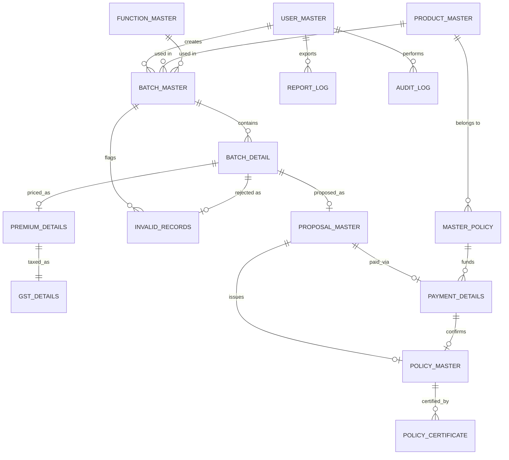

# MotorPortalDB

PostgreSQL database schema, scripts, functions, procedures and seed data for the Motor Portal application.

Database: `SGInsuranceDB` · Schema: `SGInsurance` · Engine: PostgreSQL 15+

## Running the migration

```bash
# from this repo's root, with a reachable Postgres server
export PGHOST=localhost PGPORT=5432 PGUSER=postgres PGPASSWORD=yourpassword
# on Windows, point PSQL at the installed binary if it's not on PATH:
export PSQL="/c/Program Files/PostgreSQL/16/bin/psql"
bash migrate.sh
```

This creates the `SGInsuranceDB` database (if missing), the `SGInsurance` schema,
all 15 tables with constraints/indexes, the PL/pgSQL functions/procedures, the
reporting view, and seed data — in that order, idempotently (safe to re-run).

To start over: `psql -d SGInsuranceDB -f rollback.sql` (drops the whole schema),
then re-run `migrate.sh`.

Seeded login: username `admin`, password `admin123` (bcrypt-hashed via `pgcrypto`).

## Folder structure

```
scripts/
  00_create_database.sql
  01_create_schema.sql
  02_tables/            one file per table (15 files)
  03_constraints_indexes.sql
  04_functions/         functions & procedures (one file each)
  05_views/
  06_seed_data.sql
migrate.sh
rollback.sql
```

## Entities (15)

USER_MASTER, PRODUCT_MASTER, FUNCTION_MASTER, MASTER_POLICY, BATCH_MASTER,
BATCH_DETAIL, INVALID_RECORDS, PREMIUM_DETAILS, GST_DETAILS, PROPOSAL_MASTER,
PAYMENT_DETAILS, POLICY_MASTER, POLICY_CERTIFICATE, REPORT_LOG, AUDIT_LOG.

## ER diagram



## Functions & procedures

| Name | Type | Purpose |
|---|---|---|
| `fn_calculate_net_premium(base, addon, discount)` | function | `NET = base + addon - discount` |
| `fn_calculate_gst(net_premium, gst_rate)` | function | returns `(gst_amount, final_premium)` |
| `fn_generate_proposal_no()` | function | unique proposal number, e.g. `1202304500/01` |
| `fn_generate_policy_no(office_code, class_code)` | function | unique policy number, e.g. `3010/A/443668109/00/000` |
| `sp_process_batch_validation(batch_id)` | procedure | validates every case in a batch, writes `INVALID_RECORDS`, sets `RECORD_STATUS`, updates `BATCH_MASTER` counters, advances status to `VALIDATED` |
| `sp_tag_payment(proposal_id)` | procedure | checks/deducts `MASTER_POLICY.CD_BALANCE` and inserts `PAYMENT_DETAILS` inside one transaction; raises a specific error if insufficient |
| `sp_advance_batch_status(batch_id, new_status)` | procedure | enforces the 9-state lifecycle strictly, one step at a time |

Batch lifecycle (enforced by `sp_advance_batch_status`, no skipping):
`UPLOADED → VALIDATED → PREMIUM_CALCULATED → GST_CALCULATED → PROPOSAL_CREATED → PAYMENT_PENDING → PAYMENT_PROCESSED → POLICY_CREATED → PRINTED`

## Verification

Ran `migrate.sh` against a local PostgreSQL 16 instance: all 15 tables + view
created, seed data inserted (admin user, 3 products, 5 functions, 10 master
policies, 3 sample batches in different states). Exercised manually and
confirmed working: `sp_process_batch_validation` correctly rejects a batch
detail with an unknown master policy; `sp_advance_batch_status` rejects an
out-of-order jump (`VALIDATED → PRINTED`); `fn_generate_proposal_no` /
`fn_generate_policy_no` produce unique formatted numbers; `sp_tag_payment`
deducts `CD_BALANCE` and inserts `PAYMENT_DETAILS` on success, and raises
"Insufficient CD balance..." **without** touching the balance when the
master policy's balance is too low; `vw_policy_issue_report` returns the
expected joined columns.

## Progress

- [x] Bootstrap (ground rules, README, .gitignore)
- [x] 15 core tables + FKs + indexes
- [x] PL/pgSQL functions & procedures (premium, GST, proposal/policy numbers, validation, payment, lifecycle)
- [x] Reporting view `vw_policy_issue_report`
- [x] Seed data (admin user, products, functions, master policies, sample batches)
- [x] migrate.sh / rollback.sql verified end-to-end
